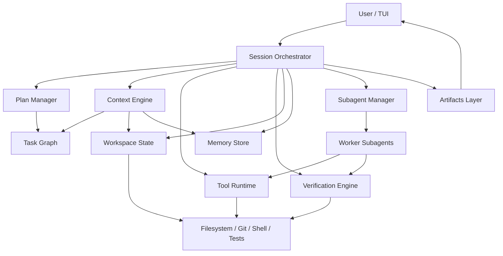

# Codi Agent Handoff

## Goal

Build a new personal coding agent iteratively, using:

- Pi for modular runtime, session model, extensions, skills, and TUI layering
- OpenCode for plan/build separation and multi-client shape
- Hermes for durable workflows, delegation patterns, and persistence ideas

Do not rename Pi or fork the whole product into a full rebrand. Build a new agent alongside it.

## Product Direction

Version `0.1` is a coding agent only.

It should:

- run in a terminal
- create and track a structured plan
- execute one task node at a time
- verify work with evidence
- support bounded worker subagents later

It should not:

- be a general personal assistant
- include browser automation by default
- include Slack/email/scheduler features
- depend on long transcript memory

## Core Architecture



## Required Subsystems

### 1. Session Orchestrator

Main state machine:

- `intake`
- `plan`
- `execute`
- `verify`
- `summarize`

The orchestrator is the only component allowed to move between phases.

### 2. Plan Manager

Maintain a task graph, not prose-only plans.

Each task needs:

- `id`
- `goal`
- `status`
- `dependencies`
- `acceptance_criteria`
- `notes`

### 3. Workspace State

Canonical source of truth for:

- cwd
- changed files
- git branch/status
- last command results
- test results
- artifacts produced during the task

### 4. Context Engine

Rebuild fresh context per step from:

- current task node
- relevant files
- recent tool evidence
- short working summary
- repo/user memory

Do not rely on a giant accumulated transcript.

### 5. Tool Runtime

Initial tools:

- `read`
- `find`
- `grep`
- `edit`
- `write`
- `bash`
- `git-status`
- `git-diff`
- `test`

Return typed results where possible.

### 6. Verification Engine

Tasks are only complete with evidence:

- tests passed
- command output validated
- file diff matches intent
- or explicit user waiver

### 7. Subagent Manager

Not required for the first commit, but design for it now.

Subagents must be:

- bounded
- disposable
- given explicit input contracts
- required to return summary + evidence + unresolved risks

### 8. Memory Store

Keep memory small and typed:

- user preferences
- repo conventions
- prior decisions

Do not treat old chat logs as state.

### 9. Artifacts Layer

Store:

- plan snapshots
- diffs
- test results
- summaries
- decision notes

These should be readable by both the user and future agent runs.

## Early Design Decisions

### Plan-first, not transcript-first

Execution should always point to a plan node.

### Evidence-based completion

Completion is not “the model thinks it is done.”

### Fresh context each cycle

No giant rolling prompt.

### Small explicit memory

Persist only stable facts.

### Strict subagent contracts

Subagents are workers, not free-form collaborators.

## Minimal MVP Spec

### In Scope

- terminal UI
- single active session
- task graph persistence
- plan mode
- execute mode
- verification pass
- final summary with evidence

### Out of Scope

- IDE plugin
- browser
- scheduler
- messaging integrations
- autonomous background execution
- complex multi-agent orchestration

### MVP User Flow

1. User gives task.
2. Agent creates a structured plan.
3. User approves or edits the plan.
4. Agent executes one task node at a time.
5. Agent runs verification.
6. Agent summarizes outcome with evidence.

## Recommended Repository Shape

Use a new repo or a clean subproject, not a hard rename of Pi.

Suggested layout:

```text
codi-agent/
  package.json
  README.md
  src/
    cli.ts
    main.ts
    orchestrator/
      session-orchestrator.ts
      phases.ts
    planning/
      task-graph.ts
      plan-manager.ts
    context/
      context-engine.ts
      summaries.ts
    workspace/
      workspace-state.ts
      artifacts.ts
    tools/
      runtime.ts
      read.ts
      grep.ts
      edit.ts
      write.ts
      bash.ts
      git.ts
      test.ts
    verify/
      verification-engine.ts
    memory/
      memory-store.ts
      types.ts
    tui/
      app.ts
      views/
    subagents/
      worker-contract.ts
      manager.ts
  docs/
    architecture.md
    mvp.md
    handoff.md
```

## Implementation Order

### Phase 1

- scaffold repo
- add `cli.ts`
- add `main.ts`
- add `SessionOrchestrator`
- define phase/state types

### Phase 2

- implement task graph types
- implement plan persistence
- add workspace state snapshotting

### Phase 3

- implement core tools: read, grep, edit, write, bash
- define typed tool result envelopes

### Phase 4

- implement verification engine
- add test command support
- add evidence summary generation

### Phase 5

- build minimal TUI
- show plan, active step, tool output, verification result

### Phase 6

- add bounded subagent contracts
- do not add autonomous orchestration yet

## What To Read From Pi

Read in this order:

### Entry and bootstrap

- [packages/coding-agent/package.json](/Users/ever/Documents/GitHub/Codi/packages/coding-agent/package.json)
- [packages/coding-agent/src/cli.ts](/Users/ever/Documents/GitHub/Codi/packages/coding-agent/src/cli.ts)
- [packages/coding-agent/src/main.ts](/Users/ever/Documents/GitHub/Codi/packages/coding-agent/src/main.ts)

### Runtime

- [packages/coding-agent/src/core/sdk.ts](/Users/ever/Documents/GitHub/Codi/packages/coding-agent/src/core/sdk.ts)
- [packages/coding-agent/src/core/agent-session.ts](/Users/ever/Documents/GitHub/Codi/packages/coding-agent/src/core/agent-session.ts)
- [packages/coding-agent/src/core/session-manager.ts](/Users/ever/Documents/GitHub/Codi/packages/coding-agent/src/core/session-manager.ts)
- [packages/agent/src/agent-loop.ts](/Users/ever/Documents/GitHub/Codi/packages/agent/src/agent-loop.ts)

### Resources

- [packages/coding-agent/src/core/resource-loader.ts](/Users/ever/Documents/GitHub/Codi/packages/coding-agent/src/core/resource-loader.ts)
- [packages/coding-agent/src/core/package-manager.ts](/Users/ever/Documents/GitHub/Codi/packages/coding-agent/src/core/package-manager.ts)
- [packages/coding-agent/src/core/extensions/loader.ts](/Users/ever/Documents/GitHub/Codi/packages/coding-agent/src/core/extensions/loader.ts)
- [packages/coding-agent/src/core/extensions/runner.ts](/Users/ever/Documents/GitHub/Codi/packages/coding-agent/src/core/extensions/runner.ts)
- [packages/coding-agent/src/core/skills.ts](/Users/ever/Documents/GitHub/Codi/packages/coding-agent/src/core/skills.ts)
- [packages/coding-agent/src/core/system-prompt.ts](/Users/ever/Documents/GitHub/Codi/packages/coding-agent/src/core/system-prompt.ts)

### TUI

- [packages/coding-agent/src/modes/interactive/interactive-mode.ts](/Users/ever/Documents/GitHub/Codi/packages/coding-agent/src/modes/interactive/interactive-mode.ts)
- [packages/tui/src/tui.ts](/Users/ever/Documents/GitHub/Codi/packages/tui/src/tui.ts)

## What To Steal From Each Project

### Pi

- runtime/session layering
- package/resource system
- TUI separation
- skills/extensions loading

### OpenCode

- plan vs build mode split
- client/server mental model
- attachable backend

### Hermes

- persistent workflows
- automation ideas
- durable delegation patterns

## Ralph/Wiggum Process Adaptation

Use the Ralph/Wiggum idea as a workflow rule:

- planner creates or refines the task graph
- implementer executes a single task node
- verifier checks evidence
- summarize and hand off

Do not let planning and implementation blur together.

## Best Next Step

Next session should:

1. create a new `codi-agent/` workspace or repo
2. scaffold the directory structure above
3. implement:
   - `src/cli.ts`
   - `src/main.ts`
   - `src/orchestrator/session-orchestrator.ts`
   - `src/planning/task-graph.ts`
   - `src/workspace/workspace-state.ts`
4. stop there and review interfaces before adding tools

