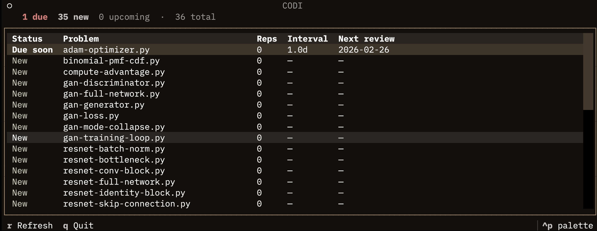
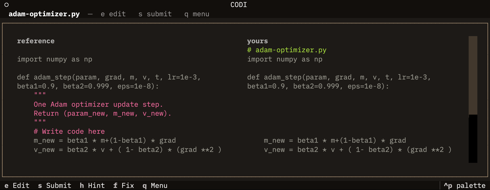
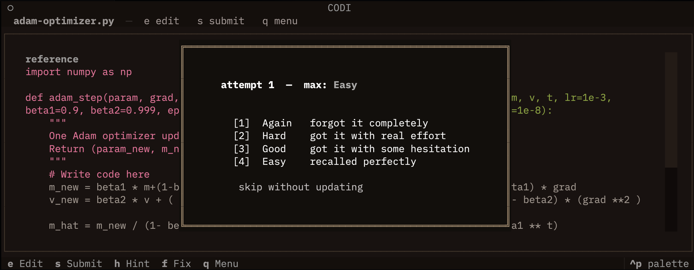
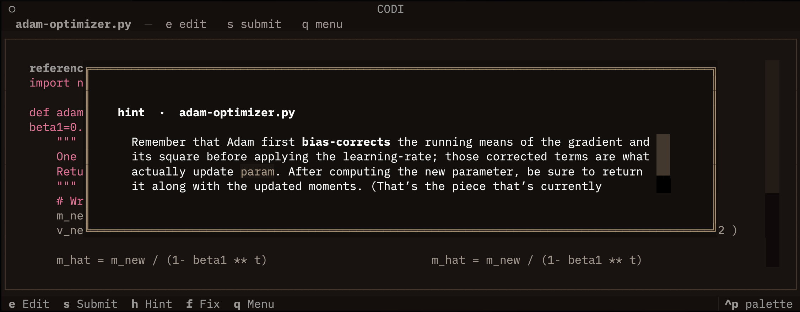
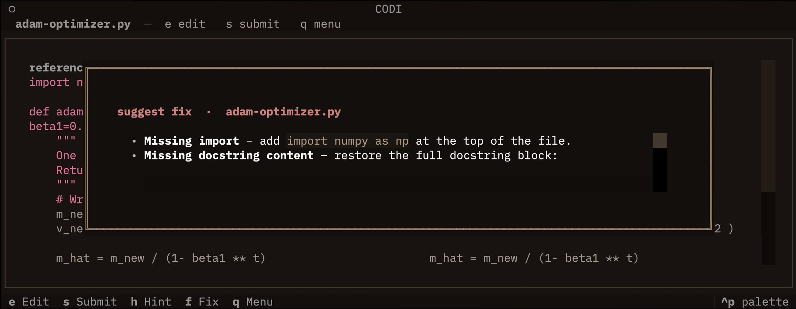

# Codi

A terminal-based spaced repetition tool for practicing ML/AI code from memory. Write implementations, compare against reference solutions with a side-by-side diff, get AI hints when stuck, and let the SM-2 algorithm schedule your reviews.



---

## Features

- **Spaced repetition** — SM-2 algorithm schedules reviews so you spend time on what you actually need to practice
- **Side-by-side diff** — your attempt vs. the reference solution, line by line
- **AI hints** — Socratic nudges that guide you without just giving away the answer
- **AI suggest fix** — targeted bullet-point suggestions when you want more direct feedback
- **158 themes** — full terminal.sexy palette, switchable live from the command palette
- **Extensible** — add any problem by dropping a `.py` file into `problems/`

---

## Screenshots

| | |
|---|---|
|  |  |
| Problem list with SM-2 schedule | Side-by-side diff |
|  |  |
| SM-2 rating (Again / Hard / Good / Easy) | AI Socratic hint |


*AI suggest fix — targeted bullet-point suggestions*

---

## Requirements

- Python 3.10+
- [`uv`](https://github.com/astral-sh/uv) (recommended) or `pip`
- A Gemini or OpenRouter API key

---

## Setup

**1. Clone the repo**

```bash
git clone https://github.com/yourusername/codi.git
cd codi
```

**2. Create a `.env` file** in the project root with your API key:

```env
# Option A — Google Gemini (default)
GEMINI_API_KEY=your_gemini_api_key_here

# Option B — OpenRouter
OPENROUTER_API_KEY=your_openrouter_api_key_here
AI_PROVIDER=openrouter

# Optional: override the default editor (default: hx / Helix)
EDITOR=nvim

# Optional: override the problems directory
# PROBLEMS_DIR=/path/to/your/problems
```

**3. Install dependencies and run**

With `uv` (recommended):

```bash
uv run app.py
```

With `pip`:

```bash
pip install -r requirements.txt
python app.py
```

---

## Usage

| Key | Action |
|-----|--------|
| `Enter` | Open the selected problem in your editor, then review |
| `r` | Refresh the problem list |
| `Ctrl+P` | Open the command palette (theme switcher, etc.) |
| `q` / `Ctrl+C` | Quit |

### Workflow

1. Select a problem from the list and press `Enter`
2. Your editor opens — write the implementation from memory
3. Save and close the editor
4. Codi shows a side-by-side diff of your attempt vs. the reference
5. Use **Hint** or **Suggest Fix** if you need AI assistance
6. Rate your recall (Again / Hard / Good / Easy)
7. SM-2 schedules the next review automatically

---

## Adding Problems

Problems are plain `.py` files. Drop any `.py` file into the `problems/` folder and it will appear in the list on the next refresh (`r`).

A problem file contains two things:

```python
# The reference solution Codi compares against
SOLUTION = """
import numpy as np

def sigmoid(x):
    return 1 / (1 + np.exp(-x))
""".strip()

# The prompt shown in the problem list
DESCRIPTION = "Implement the sigmoid function using NumPy."
```

36 curated ML problems are included covering ResNet, Transformers, GANs, U-Net, ViT, and more.

---

## Themes

Codi ships with 158 themes from [terminal.sexy](https://terminal.sexy). Switch themes live via `Ctrl+P` → search "theme".

---

## License

MIT
